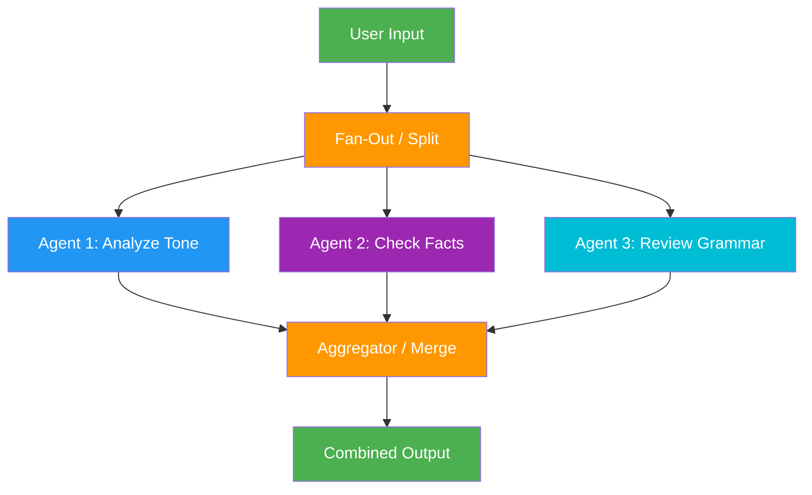

# 4. Parallelization

!!! example "Mini-Project: Editorial Review Board"
    Multiple specialist reviewers (tone, facts, grammar) analyze a document in parallel, and their feedback is merged into a unified editorial report.

    [View on GitHub :material-github:](https://github.com/saisrinivas-samoju/agentic_architectures/blob/main/mini-projects/04-editorial-review-board.ipynb){ .md-button .md-button--primary }

---

## Description

**Parallelization** fans out a task to multiple LLM calls that run concurrently, then aggregates their results. There are two main variants:

- **Sectioning:** Breaking a task into independent subtasks that run in parallel
- **Voting:** Running the same task multiple times to get diverse outputs for consensus

## When to Use

- Tasks with independent subtasks that don't depend on each other
- When you need multiple perspectives on the same problem (voting/ensemble)
- Reducing wall-clock time for multi-part analysis
- Quality assurance through redundant evaluation

## Benefits

| Benefit | Description |
|---|---|
| **Speed** | Concurrent execution reduces total time |
| **Quality** | Multiple perspectives catch more issues |
| **Robustness** | Voting reduces individual LLM errors |
| **Throughput** | Process more work in the same time window |

## Architecture Diagram

