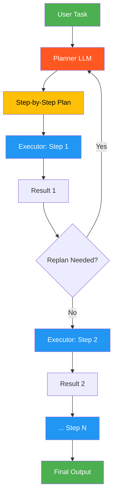

# 17. Plan-and-Execute

!!! example "Mini-Project: Research Report Plan-and-Execute"
    A planner LLM creates a structured research plan, then an executor agent carries out each step sequentially, using previous step results as context, before synthesizing a final report.

    [View on GitHub :material-github:](https://github.com/saisrinivas-samoju/agentic_architectures/blob/main/mini-projects/17-research-report-plan-execute.ipynb){ .md-button .md-button--primary }

---

## Description

**Plan-and-Execute** separates planning from execution into two distinct phases. A **Planner** LLM creates a step-by-step plan for the task, and an **Executor** agent carries out each step sequentially. After each step completes, the planner can optionally re-evaluate and adjust the remaining plan based on intermediate results. This prevents the agent from getting lost in reactive loops and ensures goal-directed behavior.

## When to Use

- Complex multi-step tasks requiring strategic planning
- When you need a visible, auditable execution plan
- Tasks where intermediate results may require plan adjustments
- Research workflows with dependent information-gathering steps

## Benefits

| Benefit | Description |
|---|---|
| **Goal-Directed** | Agent follows a deliberate plan rather than reacting |
| **Auditability** | The plan is visible and reviewable before execution |
| **Adaptability** | Plan can be revised based on intermediate results |
| **Reduced Drift** | Prevents the agent from going off on tangents |

## Architecture Diagram

