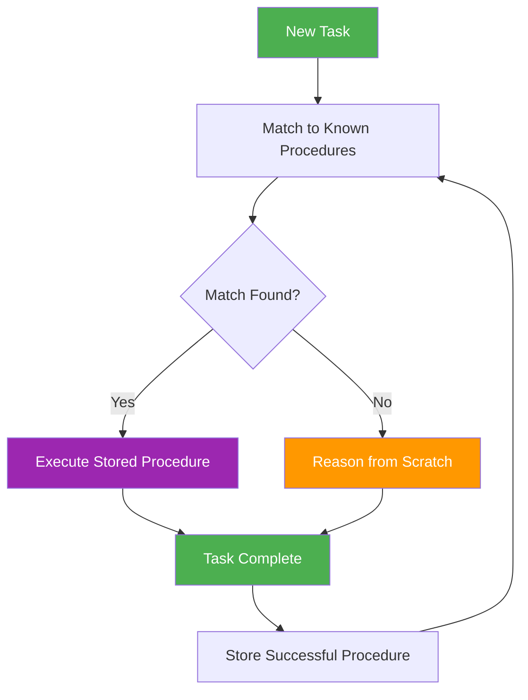
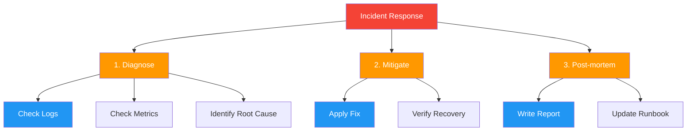

# 48. Procedural Memory

!!! example "Mini-Project: Procedural Memory for an Operations Agent"
    A procedural memory system for an operations agent that stores named workflows (deploy, debug), matches incoming tasks via fast keyword lookup or LLM-based fuzzy matching, and executes the stored step-by-step procedure when a match is found.

    [View on GitHub :material-github:](https://github.com/saisrinivas-samoju/agentic_architectures/blob/main/mini-projects/48-procedural-memory.ipynb){ .md-button .md-button--primary }

---

## What It Is

**Procedural Memory** stores **how to do things** -- learned procedures, workflows, and successful action sequences. When the agent encounters a familiar task type, it retrieves the stored procedure rather than reasoning from scratch. Like human muscle memory for complex tasks.

## What It Stores (Examples)

- Successful tool call sequences for specific task types
- Multi-step workflows (e.g., "to deploy: test, build, push, verify")
- Error recovery procedures
- Optimized prompt templates

## How It's Implemented

Uses a **key-value store** or **pattern-matching database** where task patterns are keys and procedures are values.

## Mermaid Diagram

## Extended: Hierarchical Procedural Memory

**Hierarchical Procedural Memory** organizes procedures into a tree hierarchy -- high-level strategies contain sub-procedures, which contain atomic actions. This allows agents to reason at different abstraction levels: select a high-level strategy, then drill down into specifics. Like how "cook a meal" decomposes into "prepare ingredients" -> "chop vegetables" -> individual knife cuts.

