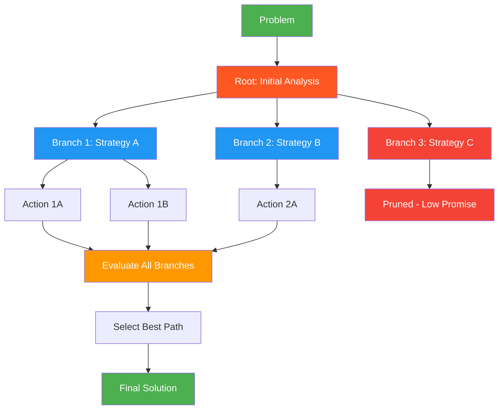

# 30. ReAcTree

!!! example "Mini-Project: ReAcTree for Multi-Strategy Problem Solving"
    Generates multiple fundamentally different strategies for a problem, executes them in parallel, self-evaluates each branch's result, and selects the highest-scoring solution.

    [View on GitHub :material-github:](https://github.com/saisrinivas-samoju/agentic_architectures/blob/main/mini-projects/30-reactree.ipynb){ .md-button .md-button--primary }

---

## Description

**ReAcTree** extends the linear ReAct (Reasoning + Acting) pattern into a tree structure. Instead of following a single reasoning path, the agent explores multiple reasoning branches simultaneously, creating a tree of thought-action-observation sequences. Each branch represents a different strategy for solving the problem. The agent evaluates branches, prunes unpromising ones, and continues the most promising paths.

This combines the strengths of Tree-of-Thoughts (ToT) with ReAct's tool-calling capability, enabling more thorough exploration of solution spaces.

## When to Use

- Complex problems where the first approach may not work
- When multiple valid strategies exist and you want to explore them
- Tasks requiring backtracking and alternative approaches
- Research and exploration tasks with uncertain paths

## Benefits

| Benefit | Description |
|---|---|
| **Exploration** | Multiple strategies explored simultaneously |
| **Resilience** | Dead-end branches are pruned, others continue |
| **Quality** | Best path is selected from multiple candidates |
| **Thoroughness** | More of the solution space is covered |

## Architecture Diagram

