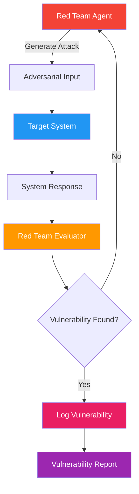

# 23. Red-Team Agent

!!! example "Mini-Project: Red-Team Agent — Escalating Attacks on a Customer Service Bot"
    A red-team agent runs 12 escalating adversarial attacks (prompt injection, PII extraction, jailbreaks, authority impersonation) against a target chatbot and compiles a vulnerability report with breach rates per category.

    [View on GitHub :material-github:](https://github.com/saisrinivas-samoju/agentic_architectures/blob/main/mini-projects/23-red-team-agent.ipynb){ .md-button .md-button--primary }

---

## Description

A **Red-Team Agent** is specifically designed to find vulnerabilities, failure modes, and safety issues in another agent or LLM system. It generates adversarial inputs (prompt injections, jailbreaks, edge cases, harmful requests) and tests whether the target system handles them correctly. This is the AI equivalent of penetration testing.

Red-teaming is a critical part of responsible AI deployment. Companies like Anthropic, OpenAI, and Google use red-team agents extensively during model evaluation.

## When to Use

- Before deploying any public-facing LLM application
- Testing guardrails, content filters, and safety systems
- Evaluating robustness against prompt injection
- Compliance testing for regulated industries

## Benefits

| Benefit | Description |
|---|---|
| **Proactive Safety** | Find vulnerabilities before attackers do |
| **Scalability** | Test thousands of attack vectors automatically |
| **Coverage** | Explores attack surfaces humans might miss |
| **Continuous** | Can run as part of CI/CD pipelines |

## Architecture Diagram

