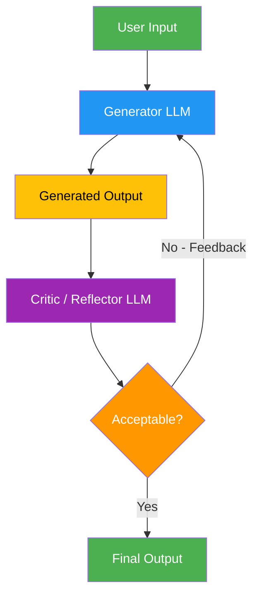

# 7. Reflection / Self-Correction

!!! example "Mini-Project: Self-Correcting Code Generator"
    A generator-critic loop that writes code, tests it, identifies errors, and iteratively fixes them until the code passes all tests.

    [View on GitHub :material-github:](https://github.com/saisrinivas-samoju/agentic_architectures/blob/main/mini-projects/07-self-correcting-code-generator.ipynb){ .md-button .md-button--primary }

---

## Description

The **Reflection** pattern creates a feedback loop where an agent generates output, evaluates it against criteria, and iteratively refines it. The agent effectively becomes its own reviewer. This can be done by a single LLM with a self-critique prompt, or by two separate LLMs (a generator and a critic).

## When to Use

- Code generation (generate, test, fix errors)
- Long-form writing that benefits from iterative polishing
- Structured data extraction requiring validation
- Any task where LLM output can be demonstrably improved through feedback
- When you have clear, measurable quality criteria

## Benefits

| Benefit | Description |
|---|---|
| **Quality** | Iterative refinement produces better output than single-shot |
| **Self-Correction** | Catches and fixes its own errors |
| **Convergence** | Typically reaches passing quality in 2-3 iterations |
| **Autonomy** | No human feedback needed in the loop |

## Architecture Diagram

