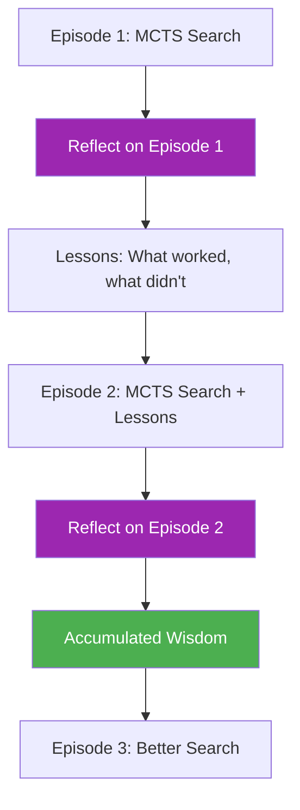

# 39. Reflective MCTS (R-MCTS)

!!! example "Mini-Project: Reflective MCTS"
    An MCTS system that runs two search episodes — after episode 1 it generates a structured reflection (what worked, what failed, specific rules), then feeds that accumulated wisdom into episode 2 to demonstrate measurable improvement in best-path scores.

    [View on GitHub :material-github:](https://github.com/saisrinivas-samoju/agentic_architectures/blob/main/mini-projects/39-reflective-mcts.ipynb){ .md-button .md-button--primary }

---

## Description

**Reflective MCTS (R-MCTS)** enhances MCTS by adding a reflection phase after each complete search episode. Instead of just backpropagating values, R-MCTS generates a natural language summary of what was learned across the entire search, then uses that summary to inform the next search episode. This enables learning across multiple search rounds.

## How It Works

After each MCTS episode (N iterations), generate a reflection summarizing successful and failed paths. Use this reflection as additional context in the next episode's selection and expansion phases.

## Diagram

