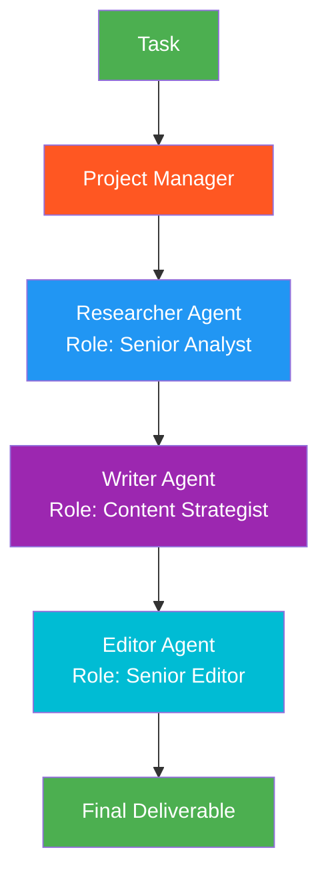

# 24. Role-Based Collaboration (CrewAI-style)

!!! example "Mini-Project: Role-Based Content Creation Team"
    A researcher, writer, and editor agent — each with a detailed backstory, unique tools, and role-specific constraints — collaborate in a structured pipeline to produce a polished article.

    [View on GitHub :material-github:](https://github.com/saisrinivas-samoju/agentic_architectures/blob/main/mini-projects/24-role-based-collaboration.ipynb){ .md-button .md-button--primary }

---

## Description

**Role-Based Collaboration** assigns specific roles with defined responsibilities, goals, and backstories to agents. Each agent has a clear persona and operates within its role's boundaries. A framework coordinates the agents through predefined task sequences or dynamic delegation. This pattern, popularized by CrewAI, mirrors how human teams work — with a project manager, researcher, writer, reviewer, etc.

The key distinction from generic multi-agent patterns is the emphasis on rich role definitions that shape agent behavior.

## When to Use

- Content creation pipelines (research, write, edit, review)
- Business workflows with distinct professional roles
- When agent behavior should be shaped by a detailed persona
- Teams where each role has clear inputs, outputs, and responsibilities

## Benefits

| Benefit | Description |
|---|---|
| **Natural Division** | Mirrors human team structures |
| **Focused Behavior** | Rich roles guide agent actions |
| **Predictable** | Clear responsibilities reduce role confusion |
| **Reusable** | Roles can be composed into different teams |

## Architecture Diagram

