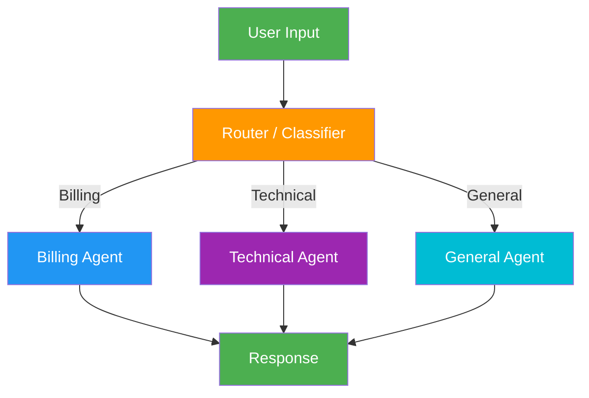

# 3. Routing

!!! example "Mini-Project: Customer Support Router"
    A router that classifies incoming customer queries and routes them to specialized support agents (billing, technical, general).

    [View on GitHub :material-github:](https://github.com/saisrinivas-samoju/agentic_architectures/blob/main/mini-projects/03-customer-support-router.ipynb){ .md-button .md-button--primary }

---

## Description

**Routing** classifies an incoming input and directs it to a specialized downstream handler. A router LLM (or rule-based classifier) examines the request and decides which specialized agent, prompt, or workflow should handle it. This enables separation of concerns and allows each branch to be optimized independently.

## When to Use

- Multi-domain applications (e.g., customer support with billing, technical, general queries)
- When different input types require fundamentally different handling
- Systems where specialized prompts outperform a single generic prompt
- Building modular systems where new capabilities can be added as new routes

## Benefits

| Benefit | Description |
|---|---|
| **Specialization** | Each route has a tailored prompt for its domain |
| **Scalability** | Add new routes without modifying existing ones |
| **Accuracy** | Focused handlers outperform generalist approaches |
| **Separation of Concerns** | Each branch is independently maintainable |

## Architecture Diagram

