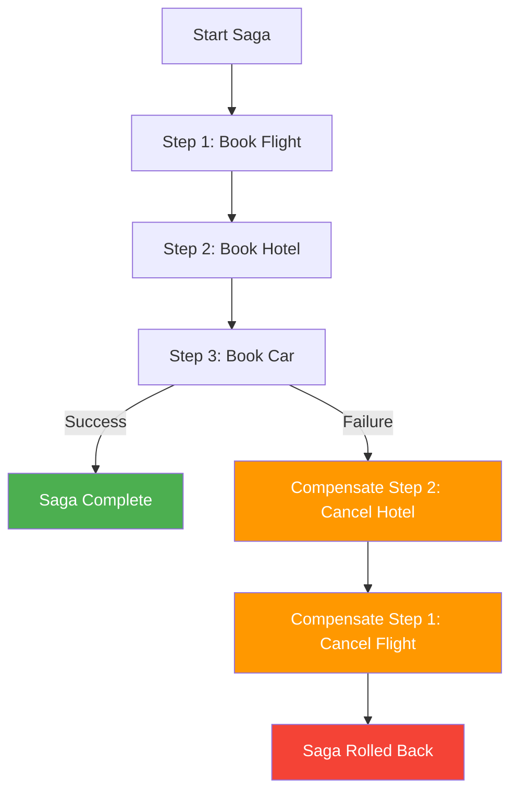

# 55. Saga Pattern for Agents (SagaLLM)

!!! example "Mini-Project: Saga Pattern for Multi-Step Agent Workflows"
    A saga executor that runs a sequence of booking steps, each with a compensation action, and automatically rolls back completed steps in reverse order when any step fails.

    [View on GitHub :material-github:](https://github.com/saisrinivas-samoju/agentic_architectures/blob/main/mini-projects/55-saga-pattern.ipynb){ .md-button .md-button--primary }

---

## Description

Prevents inconsistent state when a multi-step agent workflow fails partway through. If an agent books a flight, then fails to book a hotel, the saga pattern ensures the flight booking is compensated (cancelled).

Each step in an agent workflow has a corresponding **compensation action** (undo). If any step fails, previously completed steps are rolled back in reverse order. This ensures eventual consistency without requiring distributed transactions.

## Architecture Diagram

