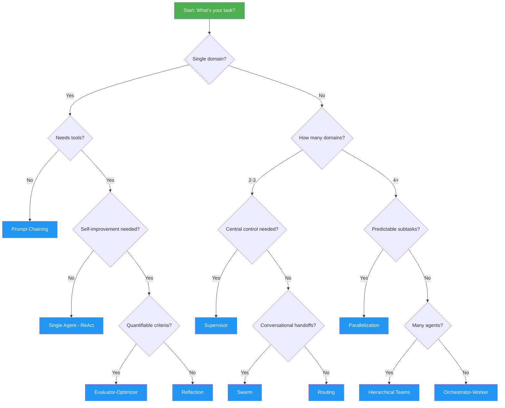

# Architecture Selection Guide

Use this decision framework to pick the right architecture for your use case.

## Decision Flowchart

## Quick Reference Table

| Architecture | Complexity | Agents | Best For |
|---|---|---|---|
| [ReAct](single-agent.md) | Low | 1 | Simple tool-augmented tasks |
| [Prompt Chaining](prompt-chaining.md) | Low | 1 | Sequential multi-step pipelines |
| [Routing](routing.md) | Low-Medium | 1 + N handlers | Multi-domain classification |
| [Parallelization](parallelization.md) | Medium | N parallel | Independent concurrent subtasks |
| [Orchestrator-Worker](orchestrator-worker.md) | Medium-High | 1 + N dynamic | Complex tasks, unpredictable decomposition |
| [Supervisor](supervisor.md) | Medium-High | 1 + N managed | Coordinated multi-agent with central control |
| [Reflection](reflection.md) | Medium | 1-2 | Self-improving output quality |
| [Evaluator-Optimizer](evaluator-optimizer.md) | Medium | 2 | Scored quality iteration |
| [Swarm](swarm.md) | High | N peer | Conversational multi-domain handoffs |
| [Hierarchical Teams](hierarchical-teams.md) | High | N nested | Large-scale enterprise workflows |
