# Architecture Selection Guide

Use these decision frameworks to pick the right architecture. Each flowchart covers one Part of this guide.

---

## Master Decision: Where to Start

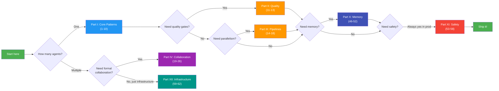

---

## 1. Core Patterns (1–10): "What kind of agent system do I need?"

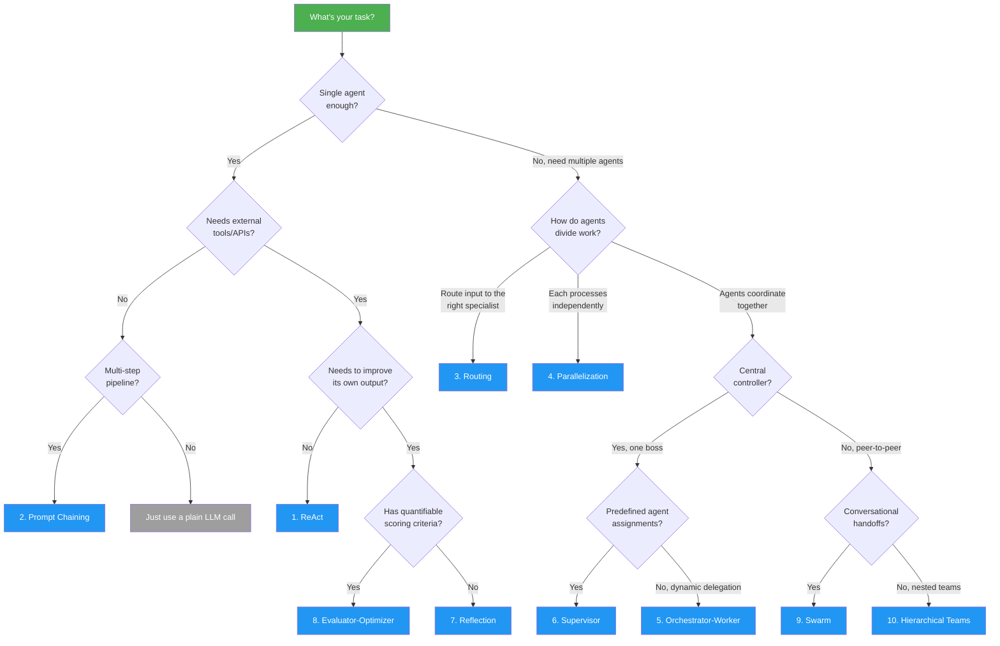

---

## 2. Quality & Verification (11–13): "How should output be verified?"

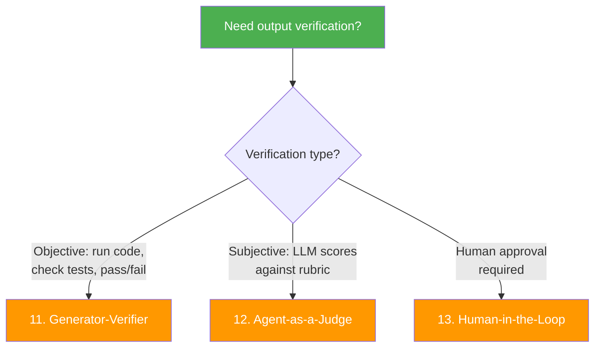

> **Already covered in Part I:** #7 Reflection (self-critique) and #8 Evaluator-Optimizer (scored iteration) are also quality patterns. Use Part II when you need *external* verification.

---

## 3. Parallelism & Pipelines (14–18): "How should work be distributed?"

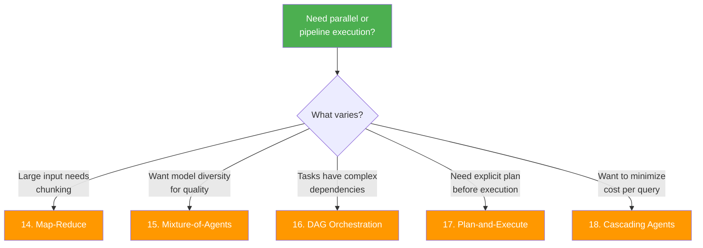

---

## 4. Multi-Agent Collaboration (19–26): "How should agents work together?"

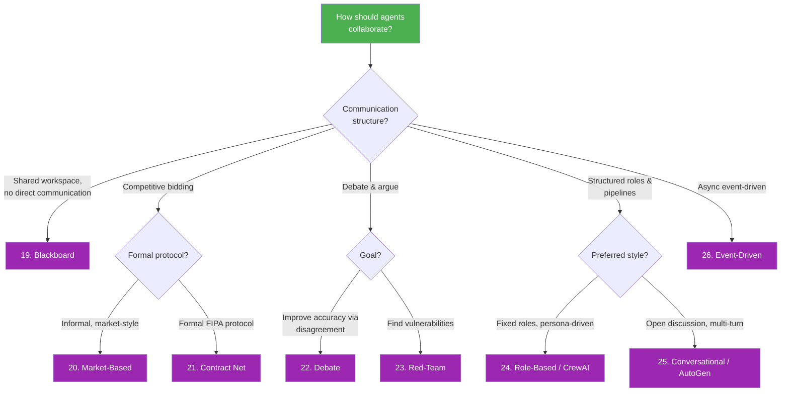

---

## 5. Reasoning Patterns (27–30): "How should the agent think?"

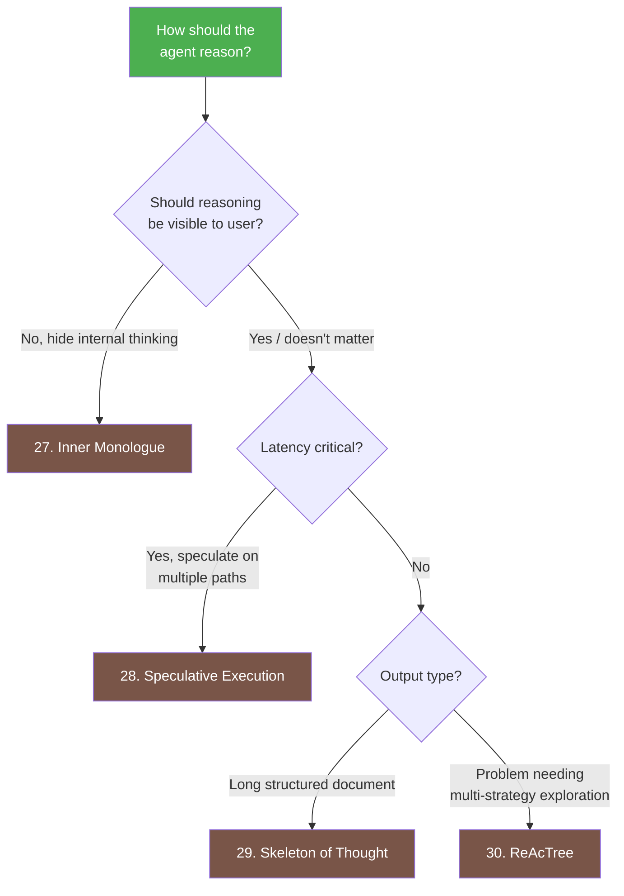

---

## 6. Domain Applications (31–34): "What domain am I working in?"

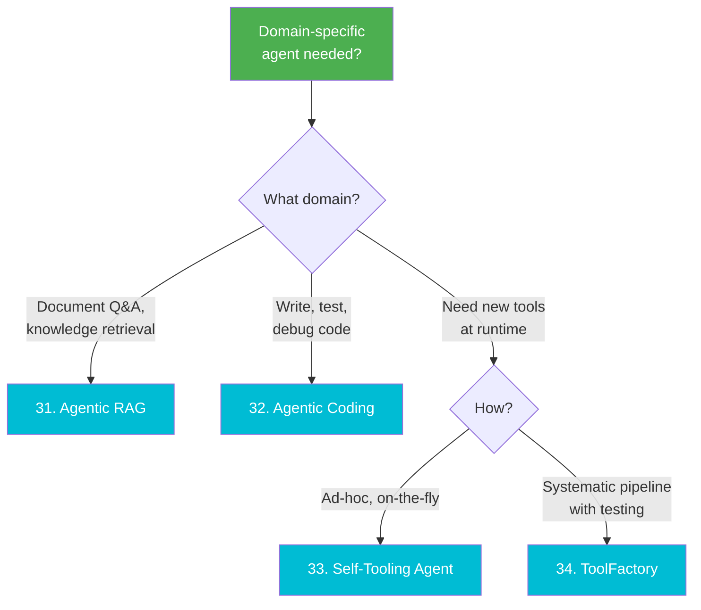

---

## 7–8. Cognitive Architectures & Advanced Search (35–41)

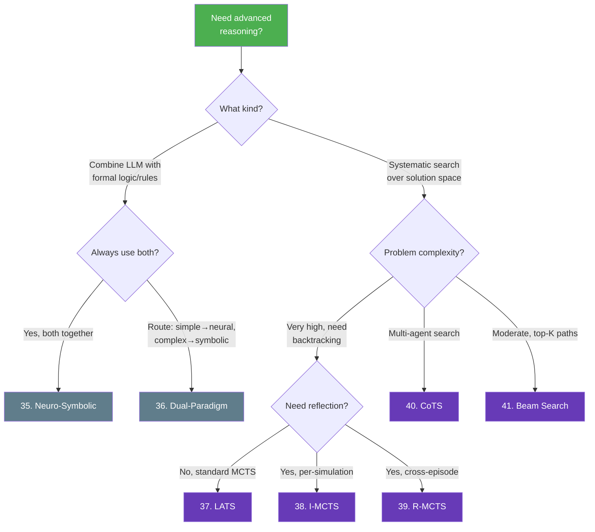

---

## 9. Agent Protocols (42–45): "How should agents connect?"

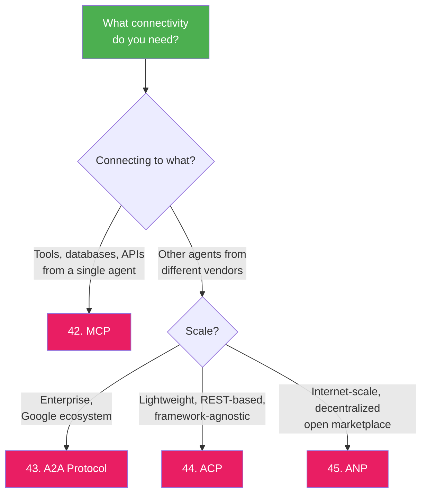

| Protocol | Created By | Transport | Best For | Maturity |
|---|---|---|---|---|
| **MCP** | Anthropic / Linux Foundation | JSON-RPC over stdio/SSE | Agent-to-tool | Production-ready |
| **A2A** | Google | HTTP + JSON-RPC | Agent-to-agent (enterprise) | Early adoption |
| **ACP** | IBM BeeAI | REST (HTTP verbs) | Agent-to-agent (lightweight) | Experimental |
| **ANP** | Community | DID + HTTP | Agent-to-agent (decentralized) | Research |

---

## 10. Agent Memory (46–52): "What should the agent remember?"

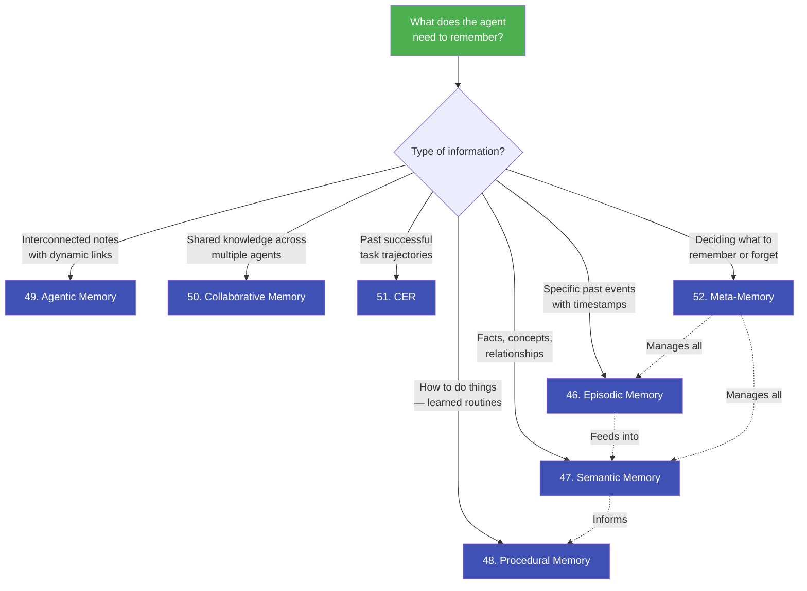

> **Tip:** Real agents typically combine 2–3 memory types. Episodic + Semantic + Procedural mirrors the human memory system. Add Meta-Memory when scale requires selective forgetting.

---

## 11. Agent Safety (53–58): "What can go wrong and how do I prevent it?"

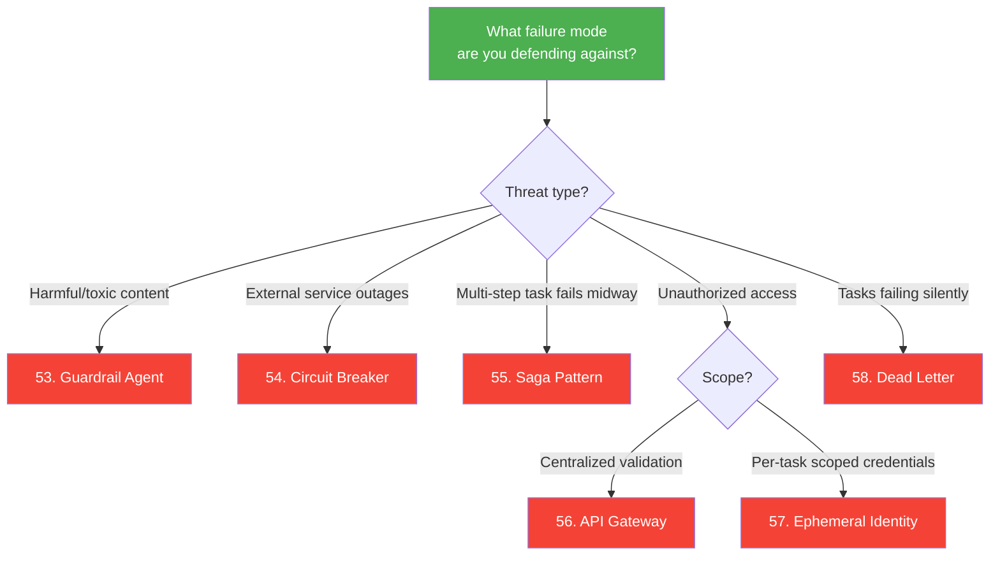

> **Production checklist:** At minimum, every production agent needs: Guardrail (content) + Circuit Breaker (availability) + Dead Letter (observability). Add Saga for multi-step workflows, Gateway + Ephemeral Identity for multi-tenant systems.

---

## Quick Reference Table

| # | Architecture | Part | Complexity | Agents | Best For |
|---|---|---|---|---|---|
| 1 | **ReAct** | I | Low | 1 | Simple tool-augmented tasks |
| 2 | **Prompt Chaining** | I | Low | 1 | Sequential multi-step pipelines |
| 3 | **Routing** | I | Low-Med | 1+N | Multi-domain classification |
| 4 | **Parallelization** | I | Medium | N | Independent concurrent subtasks |
| 5 | **Orchestrator-Worker** | I | Med-High | 1+N | Unpredictable task decomposition |
| 6 | **Supervisor** | I | Med-High | 1+N | Coordinated multi-agent control |
| 7 | **Reflection** | I | Medium | 1-2 | Self-improving output quality |
| 8 | **Evaluator-Optimizer** | I | Medium | 2 | Scored quality iteration |
| 9 | **Swarm** | I | High | N | Conversational multi-domain handoffs |
| 10 | **Hierarchical Teams** | I | High | N | Large-scale enterprise workflows |
| 11 | **Generator-Verifier** | II | Medium | 2 | Execution-based verification (code, math) |
| 12 | **Agent-as-a-Judge** | II | Medium | 2 | One-shot quality evaluation & ranking |
| 13 | **Human-in-the-Loop** | II | Medium | 1+ | High-stakes approval workflows |
| 14 | **Map-Reduce** | III | Medium | N | Processing large documents/datasets |
| 15 | **Mixture-of-Agents** | III | High | N models | Maximum quality via model diversity |
| 16 | **DAG / Graph Orchestration** | III | Medium | N | Complex dependency workflows |
| 17 | **Plan-and-Execute** | III | Medium | 1 | Strategic multi-step tasks with replanning |
| 18 | **Cascading Agents** | III | Medium | 2-3 | Cost-optimized inference |
| 19 | **Blackboard** | IV | High | N | Incremental collaborative problem-solving |
| 20 | **Market-Based / Bidding** | IV | Medium | N | Dynamic self-organizing task allocation |
| 21 | **Contract Net Protocol** | IV | Medium | N | Formal task delegation with accountability |
| 22 | **Debate / Adversarial** | IV | Medium | 2-3 | Rigorous decision analysis |
| 23 | **Red-Team Agent** | IV | Medium | 2 | Security & safety testing |
| 24 | **Role-Based (CrewAI)** | IV | Medium | N | Persona-driven team pipelines |
| 25 | **Conversational (AutoGen)** | IV | Medium | N | Emergent group problem-solving |
| 26 | **Event-Driven Multi-Agent** | IV | High | N | Reactive async multi-agent systems |
| 27 | **Inner Monologue** | V | Low | 1 | Clean output with hidden reasoning |
| 28 | **Speculative Execution** | V | Medium | 1 | Low-latency branching decisions |
| 29 | **Skeleton of Thought** | V | Medium | 1 | Fast long-form generation |
| 30 | **ReAcTree** | V | High | 1 | Multi-strategy tree exploration |
| 31 | **Agentic RAG** | VI | Medium | 1 | Intelligent document retrieval |
| 32 | **Agentic Coding** | VI | Medium | 1 | Self-healing code generation |
| 33 | **Self-Tooling Agent** | VI | Medium | 1 | Runtime tool creation |
| 34 | **ToolFactory** | VI | Medium | 1 | Systematic tool generation pipeline |
| 35 | **Neuro-Symbolic** | VII | High | 1 | LLM + formal logic/rules |
| 36 | **Dual-Paradigm** | VII | Medium | 1 | System 1/System 2 routing |
| 37 | **LATS** | VIII | High | 1 | LLM + Monte Carlo Tree Search |
| 38 | **I-MCTS** | VIII | High | 1 | Per-simulation introspective search |
| 39 | **R-MCTS** | VIII | High | 1 | Cross-episode reflective search |
| 40 | **CoTS** | VIII | High | N | Multi-agent collaborative tree search |
| 41 | **Beam Search** | VIII | Medium | 1 | Top-K solution exploration |
| 42 | **MCP** | IX | Low | — | Tool integration standard |
| 43 | **A2A** | IX | Medium | — | Cross-vendor agent communication |
| 44 | **ACP** | IX | Medium | — | Framework-agnostic agent messaging |
| 45 | **ANP** | IX | High | — | Internet-scale agent networking |
| 46 | **Episodic Memory** | X | Medium | 1+ | Learning from past experiences |
| 47 | **Semantic Memory** | X | Medium | 1+ | Storing facts and relationships |
| 48 | **Procedural Memory** | X | Medium | 1+ | Remembering how to do tasks |
| 49 | **Agentic Memory (A-MEM)** | X | High | 1+ | Interconnected knowledge notes |
| 50 | **Collaborative Memory** | X | Medium | N | Shared team knowledge |
| 51 | **CER** | X | Medium | 1+ | Prioritized experience replay |
| 52 | **Meta-Memory** | X | High | 1+ | Memory system optimization |
| 53 | **Guardrail Agent** | XI | Low | 1+ | Content safety filtering |
| 54 | **Circuit Breaker** | XI | Low | 1+ | Preventing cascading failures |
| 55 | **Saga Pattern** | XI | Medium | 1 | Multi-step rollback |
| 56 | **API Gateway** | XI | Low | N | Centralized access control |
| 57 | **Ephemeral Identity** | XI | Medium | N | Least-privilege agent execution |
| 58 | **Dead Letter** | XI | Low | 1+ | Handling failed tasks |
| 59 | **Agentic Mesh** | XII | High | N | Enterprise multi-agent infrastructure |
| 60 | **Agent Registry** | XII | Medium | N | Large-scale agent management |
| 61 | **Agent Control Plane** | XII | High | N | Agent governance and lifecycle |
| 62 | **Data Flywheel** | XII | Medium | 1+ | Continuous improvement from usage |
| 63 | **VLA Models** | XIII | Very High | 1 | Vision + language + robot actions |
| 64 | **Embodied AI** | XIII | Very High | 1 | Physical world agents |
| 65 | **World Models** | XIII | Very High | 1 | Internal environment simulation |
| 66 | **CoALA** | XIV | — | — | Agent architecture taxonomy |
| 67 | **AEGIS Framework** | XIV | High | 1+ | Comprehensive layered safety |
| 68 | **ADAS** | XIV | High | Meta | Automated agent design search |
| 69 | **MASE** | XIV | High | 1+ | Self-evolving agents |
| 70 | **Nested Learning** | XIV | High | 1 | Multi-timescale optimization |
