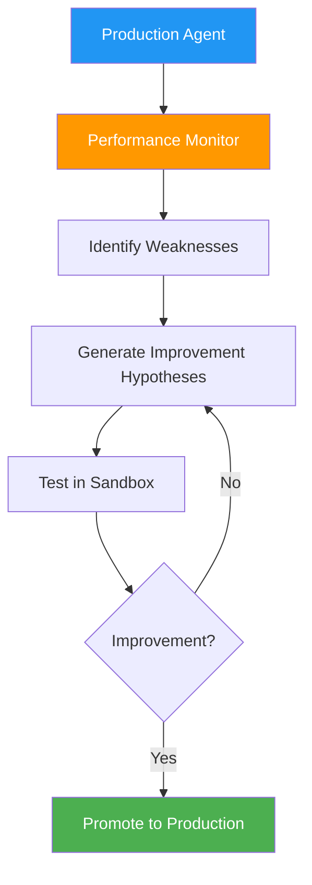

# 69. Self-Evolving Agents (MASE)

!!! example "Mini-Project: Self-Evolving Agent (MASE): Intent Classifier with Sandbox Validation"
    A customer intent classifier that evaluates its own performance on a test set, identifies misclassified queries, asks the LLM to generate an improved prompt, and promotes candidates to production only after sandbox validation confirms improvement.

    [View on GitHub :material-github:](https://github.com/saisrinivas-samoju/agentic_architectures/blob/main/mini-projects/69-self-evolving-agents.ipynb){ .md-button .md-button--primary }

---

## Description

**MASE (Multi-Agent Self-Evolution)** enables agents to improve themselves over time by analyzing their own performance, identifying weaknesses, and updating their prompts, tools, or strategies. Unlike ADAS (which searches from scratch), MASE starts with a working agent and continuously evolves it based on production feedback.

The agent monitors its own success/failure patterns, generates hypotheses about improvements, tests those improvements in a sandbox, and promotes successful changes to production.

## Architecture Diagram

