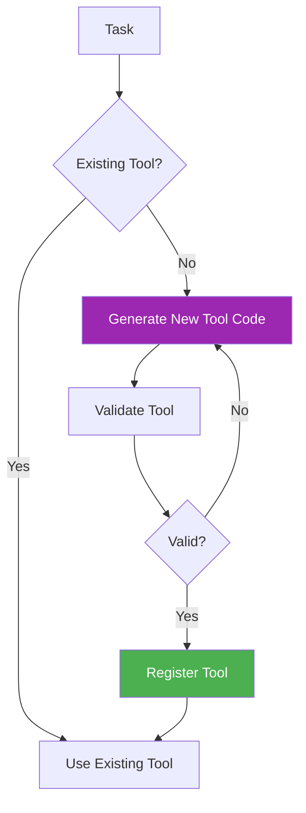

# 33. Self-Tooling Agent (STA)

!!! example "Mini-Project: Self-Tooling Agent"
    An agent that detects when it lacks the capability to complete a task, generates a new tool function at runtime, validates it with self-tests, registers it, and immediately uses it.

    [View on GitHub :material-github:](https://github.com/saisrinivas-samoju/agentic_architectures/blob/main/mini-projects/33-self-tooling-agent.ipynb){ .md-button .md-button--primary }

---

## Description

A **Self-Tooling Agent** can create new tools for itself at runtime. When the agent encounters a task it cannot handle with existing tools, it writes a new tool function, validates it, and adds it to its own toolkit. This enables open-ended capability expansion without human intervention.

## How It Works

