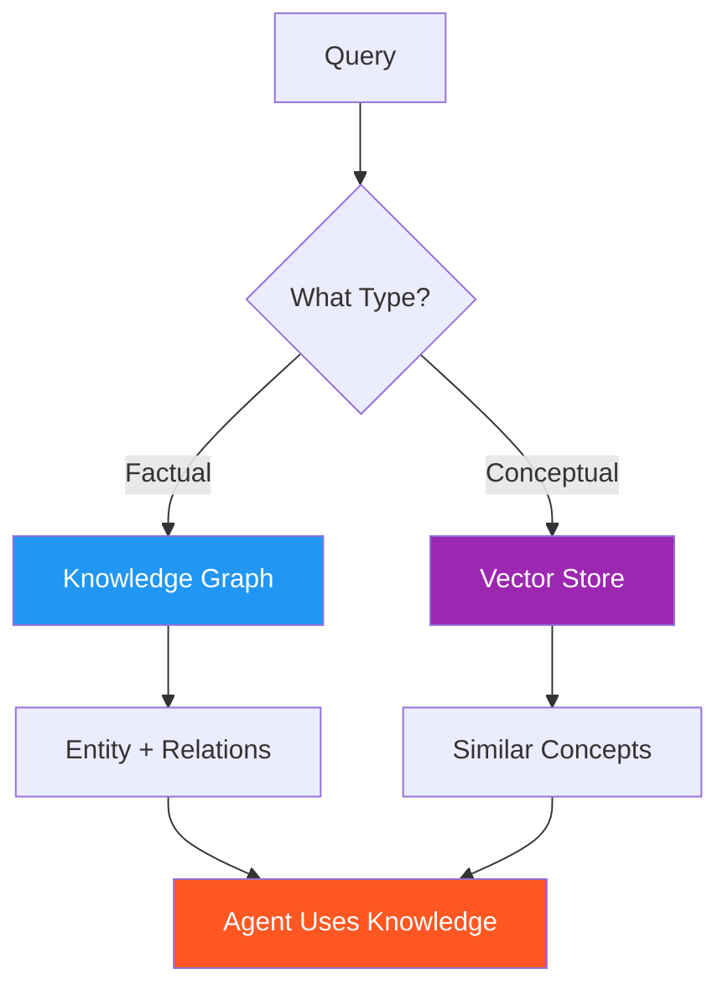

# 47. Semantic Memory

!!! example "Mini-Project: Semantic Memory: Knowledge Graph + Vector Store"
    A semantic memory system combining a knowledge graph for exact entity lookups with a vector store for open-ended conceptual queries, powering a customer success agent that answers questions using both structured and semantic retrieval.

    [View on GitHub :material-github:](https://github.com/saisrinivas-samoju/agentic_architectures/blob/main/mini-projects/47-semantic-memory.ipynb){ .md-button .md-button--primary }

---

## What It Is

**Semantic Memory** stores general knowledge, facts, and concepts independent of when they were learned. Unlike episodic memory (specific events), semantic memory stores **what the agent knows** -- factual relationships, entity definitions, and conceptual understanding. Like knowing "Paris is the capital of France" without remembering when you learned it.

## What It Stores (Examples)

- User profiles and preferences (accumulated over time)
- Domain knowledge (product specs, policies, technical docs)
- Entity relationships (customer -> orders -> products)
- Learned concepts and definitions

## How It's Implemented

Combines **knowledge graphs** (for structured relationships) with **vector stores** (for unstructured knowledge).

## Mermaid Diagram

