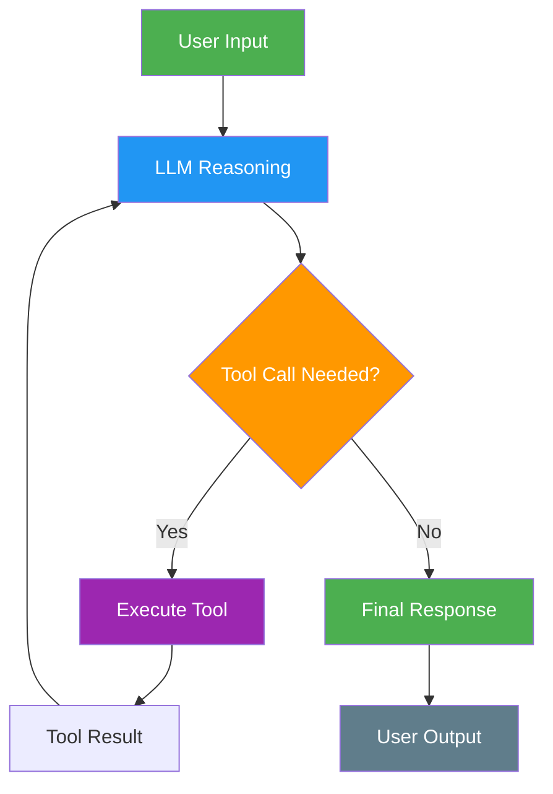

# 1. Single Agent (ReAct)

!!! example "Mini-Project: Smart Trip Budget Planner"
    A ReAct agent that uses web search and calculation tools to plan and price a custom travel itinerary.

    [View on GitHub :material-github:](https://github.com/saisrinivas-samoju/agentic_architectures/blob/main/mini-projects/01-smart-trip-budget-planner.ipynb){ .md-button .md-button--primary }

---

## Description

The **ReAct (Reasoning + Acting)** pattern is the foundational agentic architecture. A single LLM alternates between **thinking** (reasoning about what to do) and **acting** (calling tools or producing output) in a loop. The agent continues this think-act cycle until it determines the task is complete.

## When to Use

- Tasks that require a single agent with access to tools (search, calculator, APIs)
- Simple question-answering with tool augmentation
- When the problem scope is narrow enough for one agent to handle
- Prototyping and getting started with agentic systems

## Benefits

| Benefit | Description |
|---|---|
| **Simplicity** | Easiest pattern to implement and debug |
| **Transparency** | Chain-of-thought reasoning is visible at each step |
| **Flexibility** | Agent dynamically decides which tools to use and when |
| **Low Overhead** | No coordination cost between multiple agents |

## Architecture Diagram

