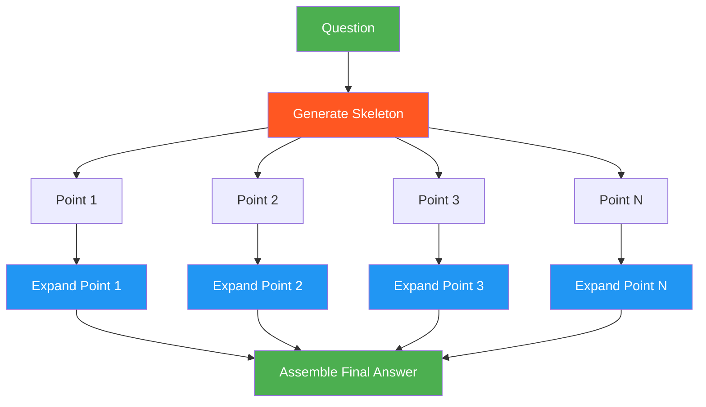

# 29. Skeleton of Thought (SoT)

!!! example "Mini-Project: Skeleton of Thought for Fast Report Generation"
    Generates a structured outline for a question first, then expands each section in parallel, and assembles them into a comprehensive final answer — significantly faster than sequential generation.

    [View on GitHub :material-github:](https://github.com/saisrinivas-samoju/agentic_architectures/blob/main/mini-projects/29-skeleton-of-thought.ipynb){ .md-button .md-button--primary }

---

## Description

**Skeleton of Thought (SoT)** is a reasoning acceleration pattern where the LLM first generates a high-level skeleton (outline) of its answer, then fills in each section in parallel. Instead of sequential token generation, SoT enables batched parallel expansion of skeleton points, significantly reducing end-to-end latency for long-form responses.

The SoT paper (Ning et al., 2023) demonstrated up to 2x speedup with comparable or better quality, because each section is generated with focused context rather than long sequential dependencies.

## When to Use

- Long-form content generation (articles, reports, documentation)
- When latency is critical and the response has natural sections
- Tasks where an outline naturally precedes detailed writing
- Parallel generation infrastructure is available

## Benefits

| Benefit | Description |
|---|---|
| **Speed** | Parallel expansion of sections reduces latency |
| **Structure** | Outline-first approach ensures coherent organization |
| **Quality** | Each section gets focused context for generation |
| **Scalability** | More sections = more parallelism = more speedup |

## Architecture Diagram

