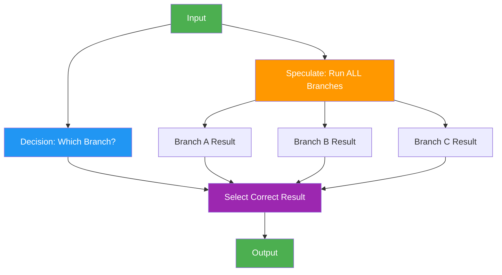

# 28. Speculative Execution

!!! example "Mini-Project: Customer Intent Prediction — Speculative Execution"
    While classifying customer message intent, speculatively prepares responses for all likely intents in parallel — when classification completes, the matching response is instantly available.

    [View on GitHub :material-github:](https://github.com/saisrinivas-samoju/agentic_architectures/blob/main/mini-projects/28-speculative-execution.ipynb){ .md-button .md-button--primary }

---

## Description

**Speculative Execution** for agents runs multiple possible next steps simultaneously before knowing which one will actually be needed. When a decision point arrives, instead of waiting for the decision and then executing, the agent speculatively executes all likely branches in parallel. Once the decision is made, the correct result is used and speculative results for unchosen branches are discarded.

This is borrowed from CPU architecture (branch prediction) and applied to agent workflows to reduce wall-clock time in decision-heavy pipelines.

## When to Use

- Decision-heavy workflows where branch execution time dominates
- When branches are independent and can be run in parallel
- Low-cost execution environments where wasted compute is acceptable
- Latency-sensitive applications

## Benefits

| Benefit | Description |
|---|---|
| **Reduced Latency** | Decision and execution happen in parallel |
| **Simple Logic** | No complex dependency tracking needed |
| **Speed** | Significant speedup for multi-branch workflows |
| **Predictable** | Known worst-case = all branches executed |

## Architecture Diagram

