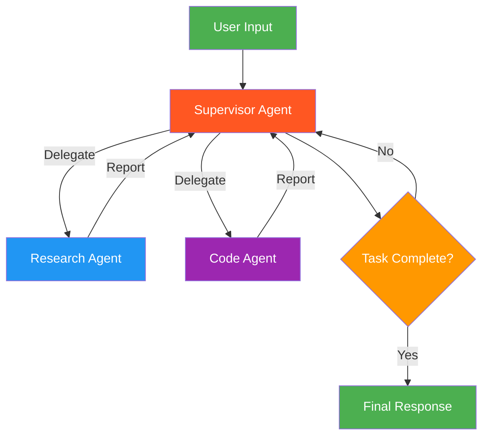

# 6. Supervisor (Hierarchical)

!!! example "Mini-Project: Data-Driven Market Analyzer"
    A supervisor that coordinates research and analysis agents iteratively to produce a comprehensive market analysis report.

    [View on GitHub :material-github:](https://github.com/saisrinivas-samoju/agentic_architectures/blob/main/mini-projects/06-data-driven-market-analyzer.ipynb){ .md-button .md-button--primary }

---

## Description

The **Supervisor** pattern places a central supervisor agent that controls all communication flow and task delegation among specialized worker agents. The supervisor decides which agent to invoke next based on the current context, receives the agent's output, and determines the next step. Unlike the Orchestrator-Worker pattern, the supervisor maintains an ongoing conversation and can re-invoke agents iteratively.

## When to Use

- When multiple specialized agents need coordinated, multi-turn interaction
- Tasks requiring iterative back-and-forth between different specialists
- When you need centralized control over agent execution order
- Complex workflows where the supervisor must reason about what to do next

## Benefits

| Benefit | Description |
|---|---|
| **Central Control** | Single point of coordination and decision-making |
| **Iterative** | Can loop back to agents based on intermediate results |
| **Specialization** | Each worker agent is an expert in its domain |
| **Observability** | All communication flows through the supervisor |

## Architecture Diagram

