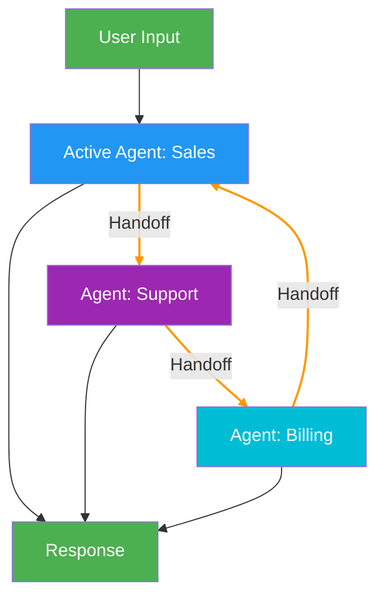

# 9. Swarm (Decentralized Handoff)

!!! example "Mini-Project: Customer Service Swarm"
    A swarm of specialist agents (sales, support, billing) that pass conversations between themselves based on the customer's needs.

    [View on GitHub :material-github:](https://github.com/saisrinivas-samoju/agentic_architectures/blob/main/mini-projects/09-customer-service-swarm.ipynb){ .md-button .md-button--primary }

---

## Description

The **Swarm** pattern enables multiple peer agents to dynamically hand off control to one another based on their specializations. There is no central supervisor -- agents decide among themselves when to transfer a conversation. Each agent has **handoff tools** that allow it to pass context to another agent. The system tracks which agent is currently active.

## When to Use

- Conversational applications with multiple domains (e.g., customer service)
- When agents need fluid, natural transitions between specializations
- Peer-to-peer collaboration without hierarchical control
- When you want agents to self-organize based on the conversation flow

## Benefits

| Benefit | Description |
|---|---|
| **Decentralized** | No bottleneck at a central supervisor |
| **Natural Flow** | Agents hand off like human team members |
| **Flexible** | Agents decide when to transfer based on context |
| **Scalable** | Add new specialist agents without restructuring |

## Architecture Diagram

