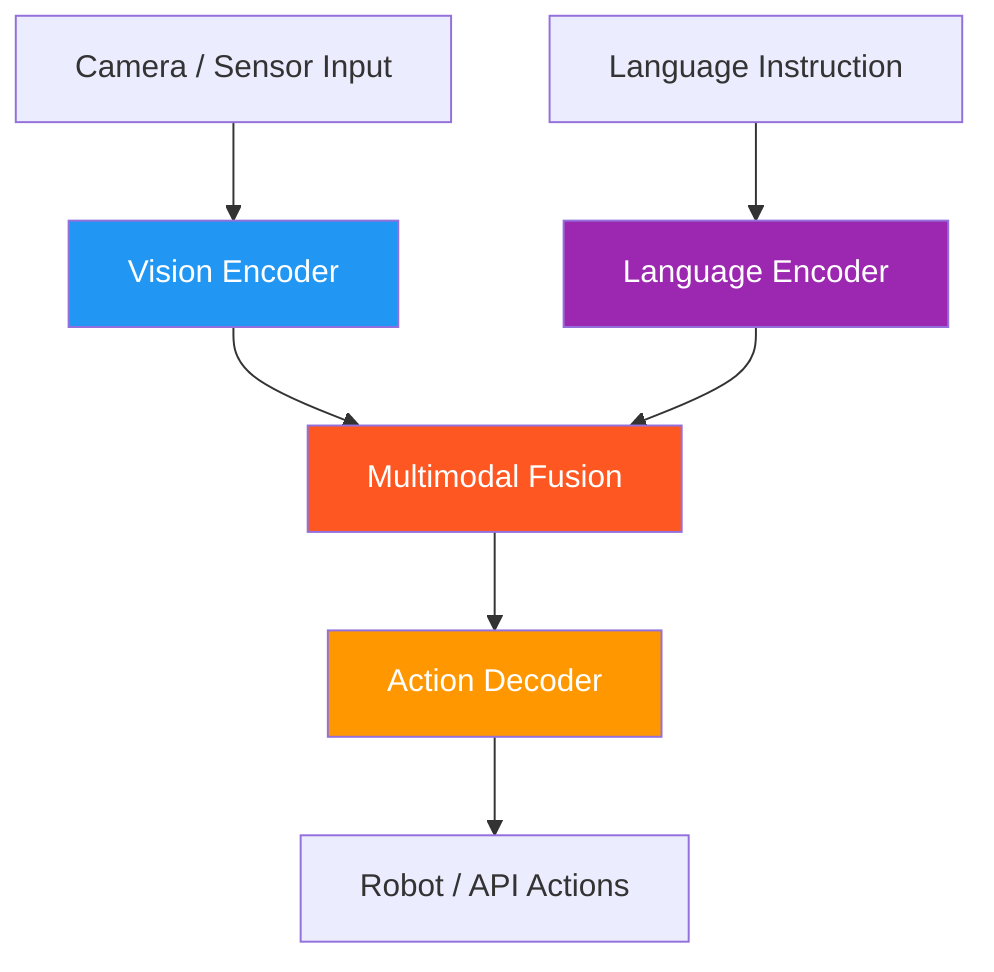

# 63. Vision-Language-Action (VLA) Models

!!! example "Mini-Project: VLA Pipeline: Warehouse Robot Sorting Items Into Bins"
    A perceive-plan-act pipeline that identifies unsorted items on a conveyor, plans an optimized pick-and-place sequence using nearest-first routing, executes the actions, and verifies correctness with dynamic replanning when paths are blocked.

    [View on GitHub :material-github:](https://github.com/saisrinivas-samoju/agentic_architectures/blob/main/mini-projects/63-vla-models.ipynb){ .md-button .md-button--primary }

---

## Description

**VLA Models** integrate vision (camera/sensor input), language (instructions/reasoning), and action (motor commands/API calls) into a unified model. They process visual observations, understand language goals, and output physical or digital actions. These models bridge the gap between LLMs (text-only) and embodied agents that need to perceive and act in the physical world.

Key examples: Google RT-2, OpenAI's vision-enabled agents, and various robotics foundation models.

## Architecture Diagram

## Key Models/Systems

| Model | Creator | Description |
|---|---|---|
| **RT-2** | Google DeepMind | Vision-Language-Action model for robot manipulation |
| **Octo** | UC Berkeley | Open-source generalist robot policy |
| **OpenVLA** | Stanford/Berkeley | Open-source VLA for robotics |
| **PaLM-E** | Google | Embodied multimodal language model |
