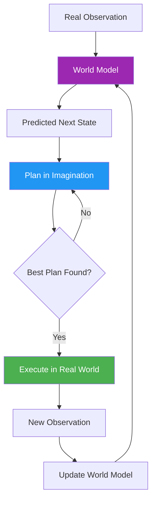

# 65. World Models

!!! example "Mini-Project: World Model: Simple Grid World Simulator"
    An agent that uses an internal world model to simulate thousands of action sequences in imagination before committing to the best plan, then verifies the advantage over a random baseline in terms of steps to reach the goal.

    [View on GitHub :material-github:](https://github.com/saisrinivas-samoju/agentic_architectures/blob/main/mini-projects/65-world-models.ipynb){ .md-button .md-button--primary }

---

## Description

**World Models** enable agents to build internal simulations of their environment and use them to plan actions without actually executing them. The agent learns a predictive model of how the world works (state transitions, physics, consequences of actions) and uses this model to "imagine" the outcomes of different plans before committing to one.

World models are critical for sample-efficient learning: instead of trying every action in the real world, the agent can simulate thousands of plans internally and pick the best one.

## Architecture Diagram

## Key Models/Systems

| Model | Creator | Description |
|---|---|---|
| **Dreamer v3** | Google DeepMind | World model for RL agents, learns from images |
| **GAIA-1** | Wayve | World model for autonomous driving |
| **UniSim** | Google | Universal simulator from real-world data |
| **Genie** | Google DeepMind | Generative interactive environment model |
